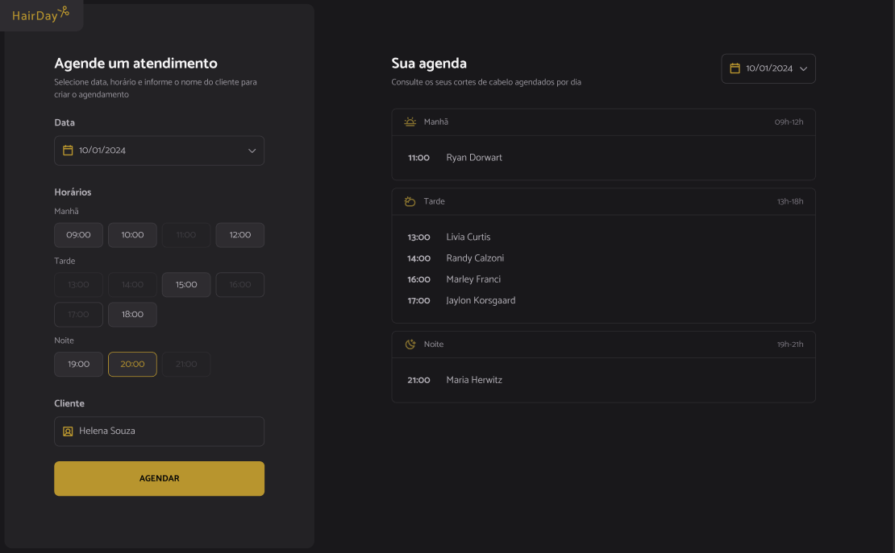

<h1 align="center">Plataforma de agendamento</h1>

Hair Day é uma aplicação web de agendamento de cortes de cabelo.

  <a href="#-tecnologias">Tecnologias</a>&nbsp;&nbsp;&nbsp;|&nbsp;&nbsp;&nbsp;
  <a href="#-projeto">Projeto</a>&nbsp;&nbsp;&nbsp;|&nbsp;&nbsp;&nbsp;
  <a href="#memo-licença">Licença</a>

  

 

  

## 🚀 Tecnologias

Esse projeto foi desenvolvido com as seguintes tecnologias:

- HTML
- CSS
- JavaScript
- Webpack
- Babel
- Day.js

## Projeto

Esse projeto é para praticar habilidades de lógica de programação, assim como javascript puro sem o uso de framework, configuração dos compiladores e bundlers manualmente.
